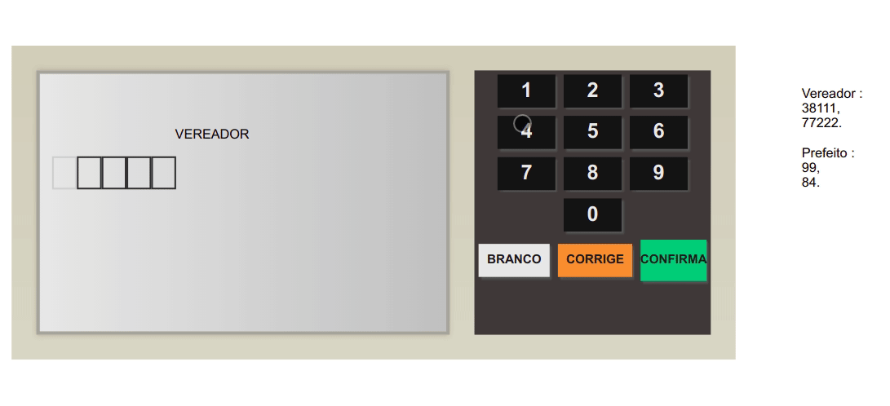

# :scroll: Urna (Ballot Box) Project
## A study project that simulates an ballot box for elections. I hope you enjoy!  :grin:

  
  

  

## :rocket: Technologies
This project was developed with the following technologies:   

- :heavy_check_mark: **HTML**
- :heavy_check_mark: **CSS**
- :heavy_check_mark: **Javascript**
  

## About this project

The idea about this project is: 
- Create steps for votes (mayor and councilor). 
- Be able to recognize votes with candidate numbers. 
- Be able to redefine the vote at each stage.
- Be able to vote blank.
- Be able to vote null, if the vote isn't recognized.
---
 

### Made with :purple_heart: by Patrick =)  

### Connect with me at [LinkedIn!](https://www.linkedin.com/in/patrick-morais/)